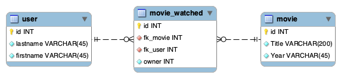

# User API

This API is used to manage user accounts. Every account has the following fields :

* Email (unique)
* Lastname
* Firstname
* Password
* isAdmin (used to know if the user is an admin or not)

We have established the following rules

* In order to perform any action, the user must be logged in through the `/session` endpoint. After that he will
 receive a JWT token that he will send in `Authorization` header.
* An admin account has all the privileges. He can `GET/PUT/DELETE all accounts through the `/users/{id}` endpoint. 
* Only an admin account can create a new user through the `/registration` endpoint.
* An user who has not admin privilege can only `GET/PUT/DELETE` his own user account.

To perform some tests, you can use these accounts :

* With admin privilege : `admin@admin.ch`
* Without admin privilege : `notadmin@admin.ch`
* **All accounts have this password:** `password`

# Movie API

For this API, we have decided to keep the same entities that we used in the first project. Namely the entities 
User - WatchedMovie - Movie. These make it possible to keep a history of the movies viewed by an user.

`user` and `movie` have CRUD operations. `movie_watched` has `create`, `read` and `delete` operations.